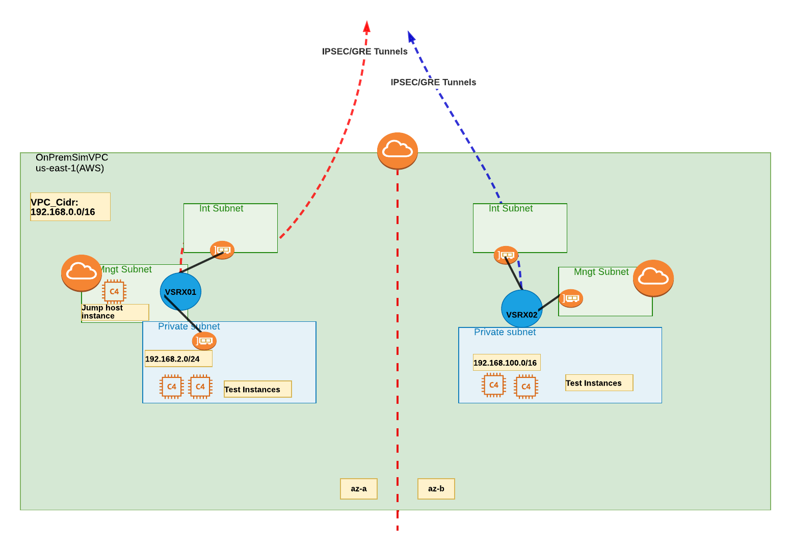

## Description

This module will deploy vSRX in an AWS region. 
Depending on the value of `no_of_secgw_in_azs` it will deploy number of vSRX. If `no_of_secgw_in_azs` is 2, it will deploy 2 
vSRX in each AZ. 
> no_of_secgw_in_azs cannot be larger than the AZ in the given region.


You can use the below command to find how many AZ are available in a given region
```sh
aws ec2 describe-availability-zones --profile <aws cli profile> --output text --region us-east-1
```

For each vSRX it will deploy 3 subnets - `management`, `internet` & `lan`, 2 `ENI` and 2 `EIP` for each AZ. It will also create the VPC for you. 
1 ENI will be associated with the internet subnet and one in the LAN subnet. They both will be attached to the vSRX.
The EIP will be assigned to vSRX and the internet facing ENI and the default ENI or management subnet ENI . The default ENI or management ENI will act as the fxp0 for vSRX
LAN  ENI will be private only no public IP. 
Internet and the management subnets are public subnets while LAN subnets are private subnet. 
For each of the subnet, it will create 3 Route tables and associate those RTBs with the respective subnets. 
It will also create all the necessary security groups. 3 in each VPC. One for management ENI/vSRX instance, one for Internet ENI and one for the LAN ENI. 
It will also deploy a jump host with an public IP in the management (public) subnet. You can use this as a jump host to ssh into the test instances.
It will also deploy a test instance in each LAN subnet by default. Number of test instances and size can be changed. So if you have 2 vsrx and 2 lan subnets, there will be 2 test instances (assuming number of test instances = 1). Test instance will be in private subnet. 
The lan subnet routing table has a default route pointing to the LAN eni of vSRX

Default Logins:
vSRX: 
  - uname: `ec2-user`
  - key: private key of key_name you pass to the module
  - login: <br> 
  `ssh ec2-user@<vsrx_fxp0_pubIP> -i <pvt_key>`

jump_host,test_instances:
**user name will change if you use a different AMI**
  - uname: `ubuntu`
  - key: private key of key_name you pass to the module
  - login jump host: </br> `ssh ubuntu@<jump_host_pub_ip> -i <pvt_key>`
  - login : test instance: </br>
```ssh -J ubuntu@<jump_host_pub_ip> -i <pvt_key> ubuntu@<test-instance-private_i -i <pvt_key>```


  

vSRX interfaces | Subnet association| pub IP
----------------|-------------------|---------
fxp0| management | yes 
ge-0/0/0 | internet | yes 
ge-0/0/1 | lan | no


## Prerequisites & Requirements
- **AMI Subscription**: Make sure you have subscribed to the vSRX ami from the market place for each AWS account you want to deploy these resources.
- **vSRX instance size**: Get the instance size you want to deploy the vSRX in. Smallest supported in c4.xlarge
- **AWS Key name**: Upload you public key to aws that you want to use for loggin into vSRX and the test instances. Ignore this step if you already have a key in aws that you want to use.
    - To use aws cli to upload your public key check    `importing_pubkey_aws.md`

- **vSRX AMI in SSM Parameter store**
> This module uses SSM parameter store for vSRX AMI id. So you need to create that
**To use aws cli to upload vsrx ami_id to ssm parameter store** 
check `ssm_parameter_config.md`

## Providers

| Name | Version |
|------|---------|
| <a name="provider_aws"></a> [aws](#provider\_aws) | 3.73.0 |


## Inputs

| Name | Description | Type | Default | Required |
|------|-------------|------|---------|:--------:|
| <a name="input_aws_cfg_profile"></a> [aws\_cfg\_profile](#input\_aws\_cfg\_profile) | aws cli profile name used for access | `string` | n/a | yes |
| <a name="input_cidr_block"></a> [cidr\_block](#input\_cidr\_block) | Cidr block in prefix/mask format for vpc has to be /16 | `string` | n/a | yes |
| <a name="input_jump_host_instance_type"></a> [jump\_host\_instance\_type](#input\_jump\_host\_instance\_type) | Jump host instance type | `string` | `"t2.micro"` | no |
| <a name="input_key_name"></a> [key\_name](#input\_key\_name) | Publik Key Name. Public key should already be uploaded in AWS for the region | `string` | n/a | yes |
| <a name="input_no_of_secgw_in_azs"></a> [no\_of\_secgw\_in\_azs](#input\_no\_of\_secgw\_in\_azs) | Number of AZ in which security gateway(vsrx) will be deployed | `number` | `2` | no |
| <a name="input_num_of_test_instances_per_lansubnet"></a> [num\_of\_test\_instances\_per\_lansubnet](#input\_num\_of\_test\_instances\_per\_lansubnet) | Number of test instances to be deployed per lan subnet | `number` | `1` | no |
| <a name="input_prefix"></a> [prefix](#input\_prefix) | A name tag to prefix all resources for easier identification | `string` | `"tf"` | no |
| <a name="input_region"></a> [region](#input\_region) | AWS region where resource is being deployed | `string` | n/a | yes |
| <a name="input_test_inst_ami"></a> [test\_inst\_ami](#input\_test\_inst\_ami) | jump host and test instance ami. Same AMI is used for both test and jump host instances | `string` | `"ami-04505e74c0741db8d"` | no |
| <a name="input_test_instance_type"></a> [test\_instance\_type](#input\_test\_instance\_type) | test instance type | `string` | `"t2.micro"` | no |
| <a name="input_vpc_name"></a> [vpc\_name](#input\_vpc\_name) | Name of the VPC | `string` | n/a | yes |
| <a name="input_vsrx_ami_ssm_name"></a> [vsrx\_ami\_ssm\_name](#input\_vsrx\_ami\_ssm\_name) | SSM value where vsrx AMIID is stored | `string` | n/a | yes |
| <a name="input_vsrx_instance_type"></a> [vsrx\_instance\_type](#input\_vsrx\_instance\_type) | Instance type to deploy vSRX | `string` | `"c4.xlarge"` | no |

## Outputs

| Name | Description |
|------|-------------|
| <a name="output_azs_used"></a> [azs\_used](#output\_azs\_used) | AZs in which vSRX are deployed |
| <a name="output_jump_host_info"></a> [jump\_host\_info](#output\_jump\_host\_info) | All jump\_host/instance attributes |
| <a name="output_subnet_info"></a> [subnet\_info](#output\_subnet\_info) | All subnets attributes under the VPC |
| <a name="output_test_instance_info"></a> [test\_instance\_info](#output\_test\_instance\_info) | All test instances attributes as map for all instances |
| <a name="output_vpc_info"></a> [vpc\_info](#output\_vpc\_info) | All VPC related attributes |
| <a name="output_vsrx_eip"></a> [vsrx\_eip](#output\_vsrx\_eip) | All attributes EIPs/Public created for vsrx |
| <a name="output_vsrx_eni"></a> [vsrx\_eni](#output\_vsrx\_eni) | All attributes for ENI associated with vsrx |
| <a name="output_vsrx_info"></a> [vsrx\_info](#output\_vsrx\_info) | All vSRX/Instance attributes as map for all instances |

## Resources

| Name | Type |
|------|------|
| [aws_eip.vsrx_eip](https://registry.terraform.io/providers/hashicorp/aws/latest/docs/resources/eip) | resource |
| [aws_eip_association.eip_vsrx_eni-ge-0-0-0](https://registry.terraform.io/providers/hashicorp/aws/latest/docs/resources/eip_association) | resource |
| [aws_eip_association.eip_vsrx_fxp0](https://registry.terraform.io/providers/hashicorp/aws/latest/docs/resources/eip_association) | resource |
| [aws_instance.ec2_jmp_host](https://registry.terraform.io/providers/hashicorp/aws/latest/docs/resources/instance) | resource |
| [aws_instance.ec2_test_inst](https://registry.terraform.io/providers/hashicorp/aws/latest/docs/resources/instance) | resource |
| [aws_instance.vsrxs](https://registry.terraform.io/providers/hashicorp/aws/latest/docs/resources/instance) | resource |
| [aws_internet_gateway.internetgw](https://registry.terraform.io/providers/hashicorp/aws/latest/docs/resources/internet_gateway) | resource |
| [aws_network_interface.enis_for_vsrx](https://registry.terraform.io/providers/hashicorp/aws/latest/docs/resources/network_interface) | resource |
| [aws_network_interface_attachment.eni-vsrx-ass](https://registry.terraform.io/providers/hashicorp/aws/latest/docs/resources/network_interface_attachment) | resource |
| [aws_route.vpc_rtbs_int_mgmt_routes](https://registry.terraform.io/providers/hashicorp/aws/latest/docs/resources/route) | resource |
| [aws_route.vpc_rtbs_lan_routes](https://registry.terraform.io/providers/hashicorp/aws/latest/docs/resources/route) | resource |
| [aws_route_table.vpc_rtbs](https://registry.terraform.io/providers/hashicorp/aws/latest/docs/resources/route_table) | resource |
| [aws_route_table_association.vsrx_sub_rtb_ass](https://registry.terraform.io/providers/hashicorp/aws/latest/docs/resources/route_table_association) | resource |
| [aws_security_group.jump_host_ssh](https://registry.terraform.io/providers/hashicorp/aws/latest/docs/resources/security_group) | resource |
| [aws_security_group.my-sg](https://registry.terraform.io/providers/hashicorp/aws/latest/docs/resources/security_group) | resource |
| [aws_security_group.test_inst_allow_all](https://registry.terraform.io/providers/hashicorp/aws/latest/docs/resources/security_group) | resource |
| [aws_security_group_rule.allow_all_outbound](https://registry.terraform.io/providers/hashicorp/aws/latest/docs/resources/security_group_rule) | resource |
| [aws_security_group_rule.https-in-lan](https://registry.terraform.io/providers/hashicorp/aws/latest/docs/resources/security_group_rule) | resource |
| [aws_security_group_rule.https-in-management](https://registry.terraform.io/providers/hashicorp/aws/latest/docs/resources/security_group_rule) | resource |
| [aws_security_group_rule.icmp-in-internet](https://registry.terraform.io/providers/hashicorp/aws/latest/docs/resources/security_group_rule) | resource |
| [aws_security_group_rule.icmp-in-lan](https://registry.terraform.io/providers/hashicorp/aws/latest/docs/resources/security_group_rule) | resource |
| [aws_security_group_rule.icmp-in-management](https://registry.terraform.io/providers/hashicorp/aws/latest/docs/resources/security_group_rule) | resource |
| [aws_security_group_rule.icmp-ipsec-4500-in-internet](https://registry.terraform.io/providers/hashicorp/aws/latest/docs/resources/security_group_rule) | resource |
| [aws_security_group_rule.icmp-ipsec-500-in-internet](https://registry.terraform.io/providers/hashicorp/aws/latest/docs/resources/security_group_rule) | resource |
| [aws_security_group_rule.ssh-in-lan](https://registry.terraform.io/providers/hashicorp/aws/latest/docs/resources/security_group_rule) | resource |
| [aws_security_group_rule.ssh-in-management](https://registry.terraform.io/providers/hashicorp/aws/latest/docs/resources/security_group_rule) | resource |
| [aws_subnet.onprem_sim_subnet](https://registry.terraform.io/providers/hashicorp/aws/latest/docs/resources/subnet) | resource |
| [aws_vpc.onprem_sim_vpc](https://registry.terraform.io/providers/hashicorp/aws/latest/docs/resources/vpc) | resource |
| [aws_availability_zones.az](https://registry.terraform.io/providers/hashicorp/aws/latest/docs/data-sources/availability_zones) | data source |
| [aws_ssm_parameter.vsrx_img_id](https://registry.terraform.io/providers/hashicorp/aws/latest/docs/data-sources/ssm_parameter) | data source |

## Usage Example
`main.tf`
```sh
module "vsrx_aws" {
  # Need to provide proper source here with relative path etc ... #TBD# 
  source = "github_path"

  #------------------REQUIRED VALUES--------------------------------------
  # Modify these values according to your requirements 

  prefix            = "" # This helps you easily identify your resources in a shared account
  vpc_name          = "onpremsim-vpc" 
  cidr_block        = "192.168.0.1/16"        # Has to be a /16  
  key_name          = "<you_key_name>" # Same key will be used for all instances 
  vsrx_ami_ssm_name = "SSM Parameter store name"
  aws_cfg_profile   = "aws_cli_profile_name"   
  region            = "us-east-1"

  #----------8<--------END REQUIRED VALUES-------->8------------------------

  #------------------OPTIONAL VALUES----------------------------------------
  /*
 no_of_secgw_in_azs (int) cannot be more than total AZ in a region 
 You can find number of AZ in a given region by using aws CLI: 
 aws ec2 describe-availability-zones --profile <aws cli profile> --output text --region us-east-1
*/

  no_of_secgw_in_azs = 2 # This cannot be more than total AZ in a region
  vsrx_instance_type = "c5.xlarge"

  # Note: Test instances will be deployed in the LAN subnet 

  num_of_test_instances_per_lansubnet = 1
  test_instance_type                  = "t2.micro"
  test_inst_ami                       = "ami-04505e74c0741db8d" # Ubuntu 20 US-EAST-1


  #------------8<------END OPTIONAL VALUES----------->8---------------------

}
```
`providers.tf`
```sh
terraform {
  required_providers {
    aws = {
      source = "hashicorp/aws"

    }

  }
}

provider "aws" {
  region  = "us-east-1"
  profile = "<aws_cli_profile_name>"
}
```


